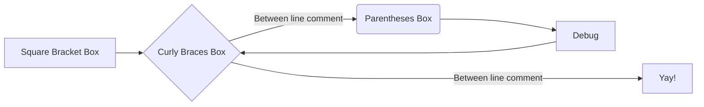
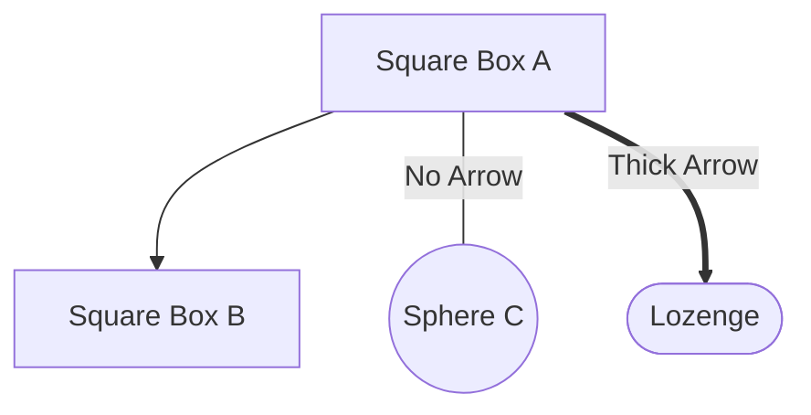

# **Hello World**

## **Hello h2** 

### **Hello h3** 

#### Hello h4 

##### Hello h5 

###### Hello h6 

---

Paragraphs  
<code>Code</code>  
<text>Text</text>  

```
Code looks like this
```

|Table | Notes | More Notes|
|:---|:---|:---|
| 1 | some stuff | rubbish |

Referenced Stuff looks like this [^Smith2023]

[^Smith2023]: Smith AB et al. Blah in blah. J of Blah Stud. 123-145:4:2023. 

Links look like this: [DuckDuckGo](https://duckduckgo.org/)  
or [DuckDuckGo](https://duckduckgo.org/ "Search") with a nice hover title.

and images look like this: 


:fontawesome-regular-face-laugh-wink:

:fontawesome-solid-crow:

:smile:

---
### Diagrams 




##### Another Top to Bottom Graph.



##### And a lot more on the Mermaid JS website docs.

--- 

### References 

[^Sarvis Milla2023]: Sarvis Milla S & Lala S. Problem Solving in Pediatric Imaging. 978-1-4377-2612-1 Elsevier 2023. 
[^Merrow2018]: Merrow C & Hariharan S. Imaging in Pediatrics. 978-0-323-47778-9 Elsevier 2018. 
[^Pomeranz2016]: Pomeranz A, Sabnis S, Busey S, Kliegman R. Pediatric Decision Making Strategies 978-0-323-29854-4.
[^Kliegman2023]: Kliegman R, Toth H, Bordini B, Basel D. Nelson Pediatric Symptom Based Diagnosis. 978-0-323-76174-1 Elsevier 2023 
