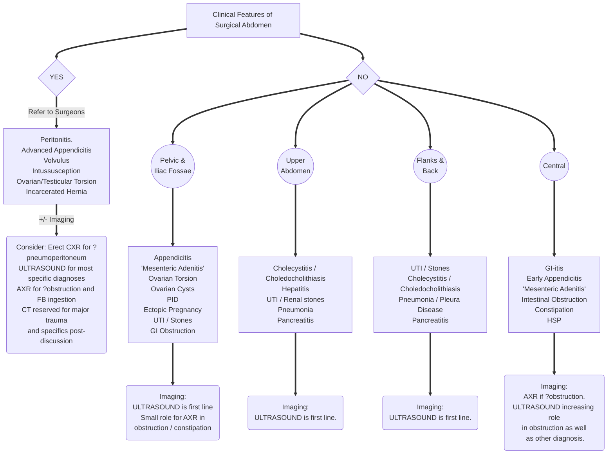

# Abdominal Pain. Vomiting. Mass. 

--- 

## Abdominal Pain 

Should be divided into Acute, potentially surgical, and Chronic. 

#### Clinical Features of Acute, Severe Abdominal Pain include: 
- Very severe with sudden onset of pain.
- Bilious Vomiting.
- Fever and other systemic disruption.
- Bloody stools.
- Localised, severe or diffuse severe tenderness on palpation.
- Involuntary guarding, rigidity and rebound tenderness.

### Differential of Acute Abdominal Pain in Childhood
| Type | 2m-2yo | 2-5yo | >5 yo |
|:---|:---|:---|:---|
| **WITH VOMITING** | | |
| | Midgut Volvulus Adhesions Intussusception Incarcerated Hernia Dairy protein allergy | Adhesions Ovarian Torsion Toxic / GI-itis | DKA Ovarian Torsion Testicular Torsion Adhesions |
| **WITH FEVER** |
| | UTI GI-itis Hepatitis Viral Infections Toxin | Gastroenteritis UTI Appendicitis Viral Infection / URTI Pneumonia Hepatitis | Gastroenteritis 'Mesenteric Adenitis' Appendicitis UTI Cholecystitis Viral Infection / URTI Pneumonia Hepatitis Pancreatitis |  
| **WITH BLOODY STOOLS** | 
| | Haemolytic Uraemic Syndrome Hirschsprung Meckels Intussusception | HUS Intussusception HSP Meckels | HUS IBD Meckels HSP |
| **OTHER IMPORTANT ONES** | 
| | Tumour FB Ingestion NAI Sickle | Constipation Tumour FB Ingestion NAI Sickle | Constipation Tumour FB Ingestion NAI Sickle |

### Pathway for Acute Abdominal Pain in Childhood

### Chronic abdominal pain in children.

Chronic and intermittent abdominal pain in children is extremely common and mostly does not have a serious or significant underlying organic pathology. Frequent diagnoses applied to this population include IBS, Functional abdomimal pain - NOS, Abdominal migraine et al. (Outlined in sections G & H of Rome IV Criteria)  
15% of schoolchildren will describe abdominal pain at least weekly and 8% will have seen an HCP about it in the past year.

Please see [Chronic abdominal pain in children. BMJ 2007](https://www.bmj.com/content/334/7601/997.long).

History and examination should identify the minority of children with alarm symptoms or features who should be further investigated.

#### Alarm Symptoms & Features (AAP/NASPHGAN 2006)  
- Involuntary weight loss  
- Deceleration of linear growth
- GI Blood loss 
- Significant vomiting
- Chronic severe diarrhoea
- Persistent RUQ and RLQ pain 
- Unexplained Fever  
- FH of IBD  

> This is not an exclusive list but further investigation generally means blood, urine and stool tests intitally more often than imaging. 

#### Role of Imaging  

Imaging has a role in only a minority of cases.  

Most referrals should be focussed on a differential, so LEFT flank pain, possibly worse with drinking, may be a UPJO or renal stones so an ULTRSOUND KUB is indicated. ULTRASOUND is the first line for most of these patients though for ?IBD, blood tests, faecal calprotectin precede possible colonscopy and ileal biopsy and then MR ENTEROGRAM.   

Referrals for US ABDOMEN for 'abd pain', not otherwise specified and without other details and with a differential of '? cause', should be rejected.   

Occasionally there will be patients with significant but undefined symptoms and other red flags. ULTRASOUND ABDOMEN is nearly always the best first line. 

---

## Vomiting 

-- 

## Abdominal Mass 

-- 

### Bibliography

[Assessment of Abdominal Pain. BMJ Best Practice](https://bestpractice.bmj.com/topics/en-gb/787)  
[^Di Lorenzo2005]: Di Lorenzo C et al. Chronic Abdominal Pain in Children. A technical report of the AAP and NASPGHAN. Journal of Pediatric Gastroenterology and Nutrition 40(3):p 249-261, March 2005. | DOI: 10.1097/01.MPG.0000154661.39488.AC
[^Sarvis Milla2023]: Sarvis Milla S & Lala S. Problem Solving in Pediatric Imaging. 978-1-4377-2612-1 Elsevier 2023. 
[^Merrow2018]: Merrow C & Hariharan S. Imaging in Pediatrics. 978-0-323-47778-9 Elsevier 2018. 
[^Pomeranz2016]: Pomeranz A, Sabnis S, Busey S, Kliegman R. Pediatric Decision Making Strategies 978-0-323-29854-4.
[^Kliegman2023]: Kliegman R, Toth H, Bordini B, Basel D. Nelson Pediatric Symptom Based Diagnosis. 978-0-323-76174-1 Elsevier 2023 
